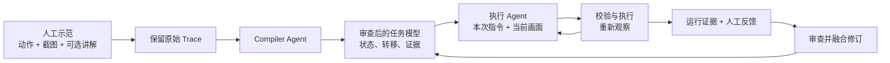

# Trace2Task

<p align="right"><a href="README.md">English</a> | <strong>简体中文</strong></p>

**把人类示范编译成可审查、可复用、可持续改进的桌面 Agent 经验。**

录制一次操作，可以边做边讲；让 Compiler 理解示范，形成任务模型；再用人工反馈不断修正。执行时，Agent 根据当前画面和本次指令重新决策，而不是照搬录制时的坐标。

Trace2Task 现在包含 **Windows 桌面软件、本地网页控制台、多种模型后端，以及检验 Trace 和经验是否有效的实验流程**。

> **项目状态：** 持续开发中的研究软件。本文描述 2026 年 9 月的当前源码，包版本号仍为 `0.18.1`；旧安装包不一定包含 `main` 的全部新功能。原生模型适配和 Cua 仍属实验能力。“动作已送达”或模型说“完成”，不等于任务已经验证成功。

[开始使用](#开始使用) · [当前功能](#当前功能) · [模型支持](#模型支持) · [量化实验](#量化验证-trace-和经验) · [文档导航](#文档导航)

## 核心是什么？

脚本保存的是**当时点哪里**；通用 GUI 模型理解的是**现在屏幕上有什么**。Trace2Task 增加了一层：**人是怎么做的、为什么这么做，以及后续反馈纠正了什么**。



项目刻意区分三种内容：

- **Trace：原始证据。** 人工操作、截图、时间和可选讲解。修改经验不改写这份记录。
- **任务模型 / `experience.yaml`：对证据的理解。** 包括状态、动作意图、前置条件、转移和终态；Compiler 可能理解错，因此允许人工修订。
- **Guidance / `guidance.yaml`：执行诀窍。** 由多轮反馈生成、审查和增量融合，保留版本历史，不是每轮覆盖掉上一轮经验。

也可以完全不用经验，以 Baseline 运行。早期 WASD 小游戏仅保留为回归测试，不再是主要使用场景。

## 当前功能

### 录制、编译和迭代经验

- 录制单个 Windows 程序窗口，或主显示器上的跨程序操作；通过 benchmark 集成层录制 WAA 虚拟机示范。
- 保存原始键鼠事件与截图，**F8** 标记示范完成，**F9** 取消。
- 可同时录制语音讲解，使用本地 Whisper Turbo 转写，人工修正后编译。普通自然语言输入框也提供语音输入。
- 教师模型、编译思考强度与执行模型分开选择。
- 把示范编译为**有向任务状态图**：支持分支、循环、回退和独立终态，不要求按编号一条路走到底。
- 在任务详情中查看证据图、状态、转移、当前生效规则，并审查确认。
- 分别修订**任务结构**和**执行诀窍**。Guidance 使用稳定 ID，通过 `add / update / keep / deprecate / conflict` 融合，保留历史。
- 修改摘要、查看融合规则、单独删除人工反馈经验；支持的本地删除流程会保留可恢复副本。

### 用一句话执行任务

```text
打开记事本，输入 hello，然后保存为文档目录里的 greeting.txt。
```

- 选择单窗口或整个主显示器，使用经验指导，或者无经验 **Baseline**。
- 通用 Agent 路径支持手选经验和适用的自动检索；桌面经验模式需要合适的已审查任务模型。
- 执行前可“只生成计划”。通用 Agent 可返回有上限的多动作批次，视觉检查点、焦点变化或异常可以丢弃剩余动作并重新观察。
- 查看进度、停止原因和无进展保护；支持 **F9 / 停止按钮**，停止延迟取决于后端。
- 通用桌面路径可启用 **LangGraph 子目标记忆与 SQLite 检查点**。恢复时重新看图，不回放旧坐标，也不盲目重试结果不确定的操作。

原生 2B 和 D 模型适配目前不接入经验或 LangGraph，不能把它们当作通用 Agent 路径的完整替代。

### 桌面软件与网页控制台

两种入口复用同一套 Python 后端和任务数据。

- **桌面窗口：** WebView2、数据目录选择、同目录单实例、启动日志和运行中的退出保护。
- **安装包构建：** PyInstaller + Inno Setup 生成按用户安装的 Windows x64 程序，自带 Python、快捷方式和卸载入口。程序、数据、模型分开存放。
- **本地模型管理：** 启动/关闭已识别的 Trace2Task 模型服务，显示加载或错误状态，跨任务复用模型，不是每次预测都重新加载。
- **统一控制台：** 录制、任务与经验详情、审查、反馈、模型选择、运行状态和逐轮模型输入输出查看。

安装程序**不包含**模型权重、Codex CLI、Cua Driver 或 benchmark 虚拟机。关闭程序不会自动卸载独立模型服务。

## 模型支持

| 模型来源 | 用途 | 当前边界 |
|---|---|---|
| **Codex 订阅 / CLI** | 通用执行、教师编译和经验修订 | 需单独安装并登录；Compiler、Revision 和 WAA 模型调用仍使用此路径。 |
| **OpenAI 兼容模型 API** | 接入自选服务商的视觉执行模型 | 需图片输入和兼容的 JSON 输出；支持自定义 ID、思考控制、`json_schema` / `json_object`，具体取决于服务商。 |
| **Qwen3-VL-8B-Instruct · Q4_K_M** | 通过 llama.cpp 运行通用本地 Agent | 独立运行环境，复用 API 经验路径；显存和上下文上限取决于配置。 |
| **Qwen3-VL-2B / GUI-Owl-1.5-2B / MAI-UI-2B** | 常驻的原生本地 GUI Baseline | BF16 适配，通常每轮一个动作，带近期真实执行历史，不接经验/LangGraph；MAI 是手机协议的 Windows 实验适配。 |
| **Trace2Task D / step 5970** | 自定义结构化动作头研究模型 | 固定 Qwen3-VL-2B 底座 + 语言注意力 LoRA + 动作头；使用冻结、校验的 record，不是聊天接口。需单独提供可信模型包，本仓库不发布这些权重。 |

三个原生 2B 模型共用常驻服务，切换时卸载上一个；D 和 llama.cpp 使用独立服务，同时运行会竞争显存。

原生输出会转换为白名单动作，不支持的动作明确报错。D 支持预测动作组与连续执行，其他原生适配通常每轮只生成一个下一步动作。`done` / terminate 只表示**模型要求停止**，不是独立成功判定。

部署方法：[Qwen 8B](docs/local-model.md)、[原生 2B 模型](docs/local-gui-models.md)、[D 模型](docs/trained-model-local.md)。

## 操作范围、后台执行和任务记忆

| 模式 | 控制什么 | 主要限制 |
|---|---|---|
| **Win32 单窗口** | 指定程序，可使用任务经验和已配置验证 | 后台消息/截图依赖应用支持，不保证游戏或最小化窗口可用。 |
| **Win32 主桌面** | 主显示器上的跨程序前台操作 | 使用你的桌面；人工输入和焦点变化可能使计划失效，当前不以副屏为执行目标。 |
| **Cua Driver · 实验性** | 为原生模型控制明确选择的窗口/启动项 | 只向模型提供授权范围，不偷偷回退前台；受驱动、应用和模型协议限制。 |
| **LangGraph · 可选** | 通用桌面 Agent 的子目标工作记忆、检查点和恢复 | 不是另一个模型、VM 快照或长期学习，不保证识图正确；不确定结果会阻止自动恢复。 |

Cua 可明确选择最多 12 个目标。Qwen 2B 有专用路由、滚动和拖动协议；不能默认 D、GUI-Owl 或 MAI 支持同样动作。正在进行的驱动调用可能需要约 20 秒才能响应停止，请先用可丢弃的测试文档验收。

## 看清模型输入、输出与实际执行

- 逐轮耗时，以及可获得的加载、预处理、生成、解码时间；原生模型还有 token 数与 GPU allocated/reserved 显存。
- 应用实际提交的任务、system/user 消息或冻结 record、截图、生成配置和适用的动作 Schema。
- 模型原始回答、解码动作、执行器输入/结果、错误、取消和被丢弃的迟到结果。
- 运行轨迹、截图、预测位置标注和本地路径，用于复盘与反馈。

通用 Agent 使用 `io-audit/`；原生本地运行还保存 `model-io.json` 和逐轮 `model-io/`。**这是应用边界日志，不是完整 TLS 抓包，也不能导出服务商隐藏的系统提示或思维过程。** 旧版本未记录的字段不能事后补回。

日志可能包含私人截图、输入文字和经验。认证字段虽会脱敏，其余内容仍可能敏感，不要直接公开上传。

## 开始使用

### 从源码启动

需要 Windows 10/11、Python 3.11+ 和 [uv](https://docs.astral.sh/uv/)。桌面窗口还需要 Microsoft Edge WebView2 Runtime。

```powershell
git clone https://github.com/DAOZHENREN/trace2task.git
cd trace2task
uv sync --extra desktop
uv run --extra desktop trace2task desktop
```

也可以继续使用浏览器控制台：

```powershell
uv run trace2task web
```

默认地址 `http://127.0.0.1:8765/`，冲突时加 `--port 8766`。修改后端后要重启程序，仅刷新网页不会更新 Python 服务。

在另一个 checkout 中复用已有数据：

```powershell
uv run --extra desktop trace2task desktop --project-root "D:\Trace2TaskData"
```

把示例路径换成自己的数据目录。不要从多个控制台同时运行桌面控制任务。

### 先验证一个无风险小任务

1. 打开“执行任务”，选择范围，先用空白记事本或测试页面。
2. 选择 **Codex、模型 API 或本地模型**。本地运行环境和权重需另行准备，选择不等于自动下载。
3. 选择 **Baseline / 不使用经验**，或后端支持的已审查经验。
4. 输入一句指令，先点“只生成计划”查看动作。
5. 核对范围后确认执行，需要时按 **F9 / 停止**。

使用 Codex 前单独运行 `codex login`。ChatGPT 订阅不等于任意 API 服务额度。

API 模式填写地址、模型 ID、密钥、思考设置和 JSON 格式。保存的密钥使用 Windows 当前用户 DPAPI 加密，仅对相同端点复用。不支持严格 Schema 时可改 `json_object`；协议不支持会报错，不会偷偷切换模型。

### 构建安装程序

仓库提供安装包**源码与构建脚本**，不把 EXE 或权重提交进 Git；本机试用包不代表 GitHub Release 已发布下载。

```powershell
uv sync --extra desktop --extra dev
uv pip install -r packaging\windows\requirements-build.txt
.\scripts\build-desktop.ps1 -Iscc "D:\Tools\InnoSetup\ISCC.exe"
```

单独安装 Inno Setup，并替换其示例路径。产物在 `dist/installer/`，自带 Python 和应用依赖，支持独立数据目录；卸载不删除数据和模型权重。试用构建尚未签名。详见[桌面程序与打包](docs/desktop-app.md)。

## 一次完整的经验闭环

1. **人工示范：** 录制方法，必要时讲清原因；即使编译失败也保留原始 Trace。
2. **教师编译：** 结合截图、动作和已审查讲解，形成状态、转移与预期效果。
3. **人工审查：** 修正任务结构、核对证据并确认任务包。
4. **执行新任务：** 根据新指令和当前画面规划，校验、执行并重新观察。
5. **复盘：** 查看真实输入输出、动作结果、截图和停止原因。
6. **迭代：** 审查增量 Guidance 或结构修订，确认后用于后续运行。

例如：示范搜索联系人并编辑消息，下一次换成不同联系人和文字。反馈“发送前先核对会话标题”可以成为经审查的 Guidance，而不是另一段固定坐标脚本。发消息是真实的外部操作，先在安全测试会话中验证。

## 量化验证 Trace 和经验

[Windows Agent Arena 集成](integrations/windows_agent_arena/) 将重置、执行和评估分开，提供 VM 示范录制、任务选择器、已验证任务级 reset 回执、Compiler 快照、实验排程和机器可读报告。

| 条件 | 执行时增加了什么 |
|---|---|
| **Baseline** | 指令和当前观察，不提供示范经验 |
| **Raw Trace** | 人工示范证据 |
| **Trace Compile** | 从 Trace 编译的语义经验 |
| **Narrated Compile** | 从 Trace + 人工讲解编译的语义经验 |
| **Feedback** | 对应编译经验 + 经审查的反馈 |

条件需要在实验规范中声明并绑定兼容的冻结资产。仅仅点了确认，**不算另一种 Reviewed compile 方法**；实质改动经验后才有理由单列比较。不是每个任务都有全部条件，也不是实验都已完成。

研究工具支持 held-out 变体、哈希、重复实验和耗时/动作/模型调用报告。远程 WAA VM 的**任务级重置不等于整机快照恢复**。WAA/VM 需单独配置，桌面软件不会自动安装它们。OSWorld 是设计参考，不是已交付的集成。

配置后的单窗口 Effect Verifier 可以生成独立回执。仅依赖截图/模型自述时标为未验证；桌面/原生运行不能因为模型输出 `done` 就当成独立验证成功。

## 隐私与能力边界

- 控制接口只监听本机回环地址，不是公网多用户服务。
- Codex/云 API 会收到规划输入。本地推理留在本机，但首次下载依赖和权重仍需联网。
- 未知动作、焦点变化、超限和不确定结果可能中止执行；保护机制不等于可安全无人值守执行任意操作。
- 不同适配器的多动作能力不同；从一张图预测动作组，不代表组内自动重新观察。
- 后台控制不是通用能力，不保证游戏、最小化窗口、管理员应用或反作弊环境可用。
- 本地路径与显卡预设来自 Windows 开发环境，其他机器要配置路径并实测显存。
- 安装/单元测试不等于模型准确率或广泛应用兼容性验证；还没有自动更新和托盘流程。
- 不要提交 `runs/`、生成任务包、检查点、权重、密钥或未脱敏录制。

## 文档导航

| 主题 | 文档 |
|---|---|
| 软件安装和数据管理 | [桌面程序](docs/desktop-app.md) |
| 录制、Baseline 与经验 | [桌面执行](docs/desktop-baseline.md) |
| llama.cpp Qwen 8B | [本地模型](docs/local-model.md) |
| Qwen 2B、GUI-Owl、MAI 与服务 | [原生 GUI 模型](docs/local-gui-models.md) |
| D 结构化动作模型 | [D 模型接入](docs/trained-model-local.md) |
| 子目标与恢复 | [LangGraph](docs/langgraph-desktop.md) |
| 明确授权的后台目标 | [Cua 后端](docs/cua-experimental-backend.md) |
| 模型/执行器日志 | [I/O 审计](docs/model-io-audit.md) · [本地运行实测](docs/local-model-runtime-validation.md) |
| 发布前修复与剩余限制 | [2026-09-22 审查记录](docs/release-audit-2026-09-22.md) |
| 讲解与证据 | [Narration](docs/narration-evidence.md) |
| 可重复研究 | [Compiler 快照](docs/compiler-snapshots.md) · [WAA 报告](docs/waa-report-format.md) |
| 研究设想，非已实现保证 | [低延迟方向](docs/research/trace-guided-low-latency-agent.md) |

<details>
<summary>展开研究架构图</summary>


图中描述架构方向，不代表每条后端路径都实现了全部验证环节。

</details>

## 开发与测试

```powershell
uv sync --extra desktop --extra dev
uv run --extra desktop --extra dev pytest
uv run --extra dev ruff check .
node --check src\trace2task\web\app.js
node --test tests/*.test.cjs
```

部分测试需要可选依赖或平台能力。真实模型/应用验收应单独进行；单元测试不是云服务验证或 benchmark 成功率。

## 致谢与许可

项目借鉴 [OpenAdapt](https://github.com/OpenAdaptAI/OpenAdapt) 的示范与验证思路、[Windows Agent Arena](https://github.com/microsoft/WindowsAgentArena) 和 [OSWorld](https://github.com/xlang-ai/OSWorld) 的评估边界，并使用 LangGraph、pywebview、PyInstaller、Inno Setup 等组件。模型及上游提示词来源在对应文档和源码中标注。

项目代码采用 [Apache-2.0](LICENSE)。外部模型、驱动和工具保留各自的许可证及分发要求。
