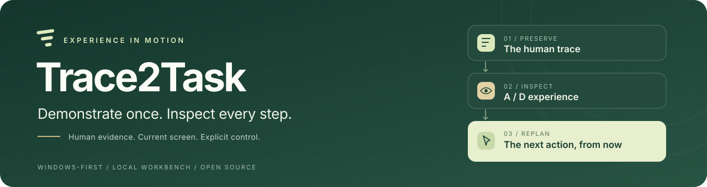
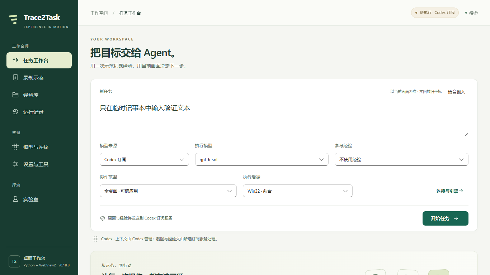

  

  <a href="README.md">English</a> · <strong>简体中文</strong>

  <a href="#快速开始">快速开始</a> ·
  <a href="#从示范到经验">使用流程</a> ·
  <a href="#选择运行方式">模型与后端</a> ·
  <a href="#文档导航">文档导航</a>

**把人类示范变成可审查的 GUI Agent 经验，一个以 Windows 为主的本地工作台。**

录下操作，决定模型能看到什么，再检查它实际做了什么。执行时以**本次指令和当前画面**为准；录制坐标只是历史参考，不是待回放的脚本。

> [!NOTE]
> **研究预览，不是可放心无人值守的自动化。** 本文对应当前源码，旧安装包可能不同。动作送达或模型说“完成”，不等于任务已经独立验证成功。

## 工作台一览

  

真实界面的隔离只读预览，任务文字为测试样例。截图过程没有调用模型或执行桌面操作；当前界面语言为中文。

- **看清模型输入。** 完整查看保存的经验文本，以及实际会发送的历史截图。
- **每个版本有据可查。** 生成时间、重复生成确认、原始记录保留，以及支持恢复的经验库回收站。
- **每个选择明确可见。** 模型来源、推理引擎、执行后端和授权目标在启动前分别确认。
- **每一步可以复盘。** 增量查看模型请求与回答、实际派发动作、执行回执和停止原因。

React / TypeScript / Fluent UI 工作台可运行在 WebView2 桌面窗口或本地浏览器中，共用 Python 后端与数据。

## 快速开始

**Windows 10/11 · Python 3.11+ · [uv](https://docs.astral.sh/uv/) · 桌面窗口另需 WebView2 Runtime**

~~~powershell
git clone https://github.com/DAOZHENREN/trace2task.git
cd trace2task
uv sync --locked --extra desktop
uv run --extra desktop trace2task desktop
~~~

桌面启动器会请求 Windows 管理员授权（UAC），取消则停止启动。请选择安装目录以外的数据目录。仓库已包含构建后的工作台资源，仅启动程序不需要 Node.js。

也可以使用浏览器：

~~~powershell
uv run trace2task web
~~~

打开 [localhost:8765](http://127.0.0.1:8765/)，端口占用时加 <code>--port 8766</code>。不要从多个实例同时执行桌面控制任务。

**先试一个小任务：** 打开空白记事本 → 选择模型与「不使用经验」→ 输入无破坏性的指令 → 核对范围和数据去向 → 确认执行。需要时使用 **停止 / F9**。模型凭据、本地权重，以及可选录制/驱动组件均需单独配置。

复用数据、开发版启动与安装包构建

不移动或覆盖数据，也可以复用已有目录：

~~~powershell
uv run --extra desktop trace2task desktop --project-root "D:\Trace2TaskData"
~~~

首次配置依赖后，可双击 <code>Start Trace2Task Dev.vbs</code> 启动源码版。修改 Python 后重启程序，修改前端后先重新构建，详见[桌面开发版](docs/desktop-development.md)。

仓库提供[安装包构建脚本](docs/desktop-app.md)，不内置模型权重，也不代表已经发布安装包下载。构建还需要 Node.js、PyInstaller 和 Inno Setup；程序、录制与权重分开存放。

## 从示范到经验

**录制 → 生成 → 审查 → 选择 → 执行 → 复盘**

1. **录制示范。** 用 OpenCUA 记录主显示器上的操作，**F8** 完成、**F9** 取消。所需组件及采集边界见[录制说明](docs/opencua-recording.md)。
2. **本地生成。** 完成官方动作整理后，生成只有动作的 **D**，或包含视觉证据的 **A**。这两种生成都不调用模型。
3. **完整审查。** 点击「查看模型原文」，阅读实际保存的全部文本；A 还展示每张选中图片。原始文件和审计信息单独保留。
4. **明确选用。** 为新任务选择某个版本，或不使用经验。新生成的版本不会自动启用。
5. **执行并复盘。** 根据当前画面，在所选范围内规划、执行、重新观察。检查运行证据，不把停止信号当作成功证明。

### 模型到底会收到什么？

| 表示 | 交给模型的经验内容 | 状态 |
| --- | --- | --- |
| **N · 无经验** | 不提供示范，只使用本次任务与当前观察 | 已实现 |
| **D · 动作序列** | 按顺序排列的动作描述、持续时间、可见子动作与点击坐标 | 已实现 |
| **A · 动作与视觉证据** | 与 D 相同的动作结构，加上**最多 8 张**历史截图及关联引用 | 已实现 |
| **B · Procedure** | 从示范中语义编译、生成后冻结的任务方法 | 设计中 |
| **C · 证据 + Procedure** | 与 A 相同的证据，加上与 B 完全相同的一份方法 | 设计中 |

A 按时间顺序等距选取可用截图，包含首尾；不足 8 张全部选择。文件路径、哈希、视频时钟和原始事件日志只留在**审计归档**，不再塞入新版 A 的模型文本。图片仅近似对齐，不保证是严格前态，也不证明动作成功。

原始录制与编译版本彼此独立。同一录制再次生成相同表示时，需要确认，旧版本保留；旧版 A 不会自动改写。

**边界要分清：** 旧 Windows/WAA 状态图、带讲解编译和经审查的 Guidance 是另外一套流程，不直接改名为 B/C，也不混入新版 A/D 执行入口。[表示与版本管理细节 →](docs/workbench.md)

## 选择运行方式

| 路径 | 已接入能力 | 主要边界 |
| --- | --- | --- |
| **Codex CLI / 订阅** | 视觉执行、旧流程的编译与修订 | 需独立安装 CLI 并登录 |
| **视觉模型 API** | 自选 Chat Completions 服务 | 必须支持图片及所请求的 JSON 格式 |
| **Qwen3-VL 8B** | 官方 Q4_K_M + F16 视觉投影，llama-server 推理 | 权重需单独准备并校验 |
| **Qwen3-VL 2B / GUI-Owl 1.5 2B** | llama-server 或 Transformers | llama 路径需完成 GGUF 转换与配置 |
| **MAI-UI 2B** | Transformers | 手机协议的 Windows 实验适配 |
| **D-5970 研究模型** | 冻结的结构化动作模型协议 | 需独立可信模型包，**不接收 A/D 经验** |

**D 经验表示**与 **D-5970 模型**不是同一个概念。

没有保存明确设置时，本地推理默认使用 llama-server；已有选择保留。不兼容的模型/引擎组合会报错，不静默切换。已注册 GUI 模型共用常驻服务与任务会话。[本地模型配置 →](docs/llama-gui-backend.md)

**实际操作：** Win32 控制前台桌面；实验性 Cua 支持明确选择窗口/应用。后台输入并非通用能力，模型选择和参考经验都不会扩大授权范围。[执行契约](docs/unified-execution-core.md) · [Cua 限制](docs/cua-experimental-backend.md)

## 证据、隐私与限制

- **先审查，再分享。** 截图、输入文字、Trace 和模型日志都可能包含隐私；认证字段脱敏不代表整份运行记录可以公开。
- **知道数据发给谁。** Codex 与远程 API 会收到任务、截图和所选经验。本地推理在本机完成，首次下载依赖与权重仍需联网。
- **把操作当作真实操作。** 先用可丢弃文件验证。停止能取消后续工作，不能撤销已经送达的动作；响应延迟取决于后端。
- **结论不越界。** 单元测试不是模型效果 benchmark；应用层审计也不能显示服务商隐藏的提示词或推理过程。
- **运行数据不进 Git。** 不要提交录制、生成经验、检查点、权重、API Key 或未脱敏运行产物。

### Android 开发预览

独立的 [Android 工程](android/README.md) 支持录制无障碍事件与抽样截图，通过自配云端视觉 API 编译经验，并操作**一个选定应用**；保留反馈版本与急停功能。

这仍是开发预览：不是完整原始触摸采集，尚未实现电脑配对。JVM 测试和 APK 构建不能代替真机与服务商联调验收。

### 研究扩展

[Windows Agent Arena](integrations/windows_agent_arena/) 分离任务重置、执行与评估；[RSIAgent](docs/rsi-integration.md) 用于单独配置的 Linux 虚拟机练习。旧 [LangGraph 检查点](docs/langgraph-desktop.md) 只属于其文档说明的执行路径，不是每个模型后端都有。

报告实验时需要明确冻结资产与实际验证方法。任务级重置不等于整机快照恢复；只点确认也不构成独立的“Reviewed compile”方法。这些接入是研究工具，不是已经获得的 benchmark 成绩。

## 文档导航

| 从这里开始 | 进一步了解 |
| --- | --- |
| [工作台与 A/D 经验](docs/workbench.md) | [动作投影契约](docs/research-D-visual-projection.md) |
| [桌面安装与打包](docs/desktop-app.md) | [源码开发](docs/desktop-development.md) |
| [llama-server 模型配置](docs/llama-gui-backend.md) | [原生模型](docs/local-gui-models.md) · [D-5970](docs/trained-model-local.md) |
| [OpenCUA 录制](docs/opencua-recording.md) | [讲解与证据](docs/narration-evidence.md) |
| [运行记录与模型审计](docs/model-io-audit.md) | [任务会话](docs/task-conversations.md) · [上下文管理](docs/local-prefix-cache.md) |
| [Android 预览](android/README.md) | [WAA 报告](docs/waa-report-format.md) · [Compiler 快照](docs/compiler-snapshots.md) |

## 开发与测试

前端开发使用 Node.js 24，与 CI 一致。

~~~powershell
uv sync --locked --extra desktop --extra dev
npm ci --prefix frontend
npm run build --prefix frontend

uv run --extra dev pytest
uv run --extra dev ruff check .
node --test tests/*.test.cjs

# 浏览器回归使用隔离、禁止写入的预览实例
cd frontend
npx playwright install
npm test
~~~

离线测试不调用真实模型，也不控制桌面；缺少特定平台能力时，相关测试可能跳过。工作台构建资源随源码提交，修改前端后需同步重新构建。

## 致谢与许可

项目使用 Python、React、Fluent UI、pywebview，以及各指南中列明的模型与运行时。感谢 [OpenCUA](https://github.com/xlang-ai/OpenCUA)、[OpenAdapt](https://github.com/OpenAdaptAI/OpenAdapt)、[Windows Agent Arena](https://github.com/microsoft/WindowsAgentArena) 与 [OSWorld](https://github.com/xlang-ai/OSWorld) 的开放研究和工具。

代码采用 [Apache-2.0](LICENSE)。外部模型、驱动和工具保留各自的许可证及分发要求。
