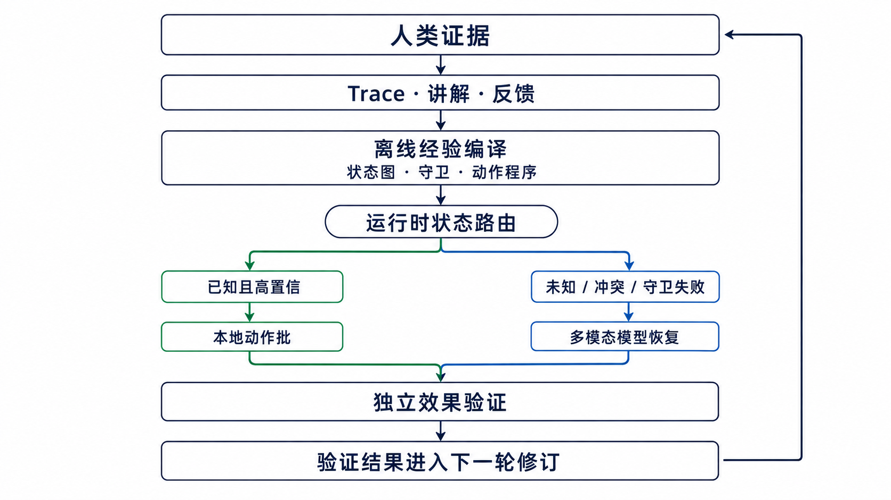

# 研究备忘录：Trace-Guided Low-Latency Desktop Agent

> 状态：研究方向草案，不代表已经验证的结论
> 记录日期：2026-09-03
> 适用项目：Trace2Task

## 一句话方向

Trace2Task 不应只把人类 Trace 当作每轮重复输入给大模型的提示词，而应把 Trace、人工讲解和多轮反馈离线编译成**带状态守卫、预期结果和恢复分支的可执行经验**；运行时优先通过本地快速匹配和批量执行复用这些经验，只在未知、冲突或恢复状态下调用多模态模型。

## 1. 问题

当前通用桌面 Agent 通常采用以下闭环：

```text
截图 → 上传模型 → 视觉理解与规划 → 返回动作 → 本地执行 → 等待画面 → 再截图
```

该闭环具有适应性，但把大模型推理放在每个操作阶段的关键路径上。当单次规划需要十几秒甚至数十秒时，即使鼠标和键盘执行本身只需几十毫秒，一个真人一两分钟完成的任务也可能被放大到数分钟或更久。

这不是 Trace2Task 独有的问题。OSWorld-Human 的时间效率研究发现，计算机使用 Agent 完成真人几分钟的任务时经常耗费数十分钟；规划、反思和判定模型占据大部分延迟，后期步骤还可能比早期步骤慢三倍。其 2026 年修订版报告，表现最好的 Agent 仍使用真人所需步骤数的 2.7–4.3 倍。[OSWorld-Human](https://arxiv.org/abs/2506.16042)

因此，核心问题不是单纯“换一个更快模型”，而是：

> 能否利用人类 Trace，把更多决策从昂贵的在线模型推理转移到可审查、可验证、可恢复的离线编译和本地执行？

## 2. Trace2Task 的初步观测

以下数据是项目本地运行的描述性观测，不应被视为跨系统结论。

### 2.1 一个具有完整分项计时的本地运行

本地运行 `20260830-072741-389529-windows-agent` 的记录显示：

| 环节 | 耗时 |
|---|---:|
| 整体运行 | 87.54 秒 |
| 规划总计 | 63.42 秒 |
| 模型回合 | 59.26 秒 |
| 截图编码 | 4.14 秒 |
| 视觉稳定等待 | 10.00 秒 |
| 显式等待动作 | 5.64 秒 |
| 本地动作执行 | 0.21 秒 |
| JSON 解析 | 0.294 毫秒 |

在这个样本中，模型回合约占规划时间的 93%，而本地答案解析可以忽略。该运行包含三次规划，模型回合平均约 19.75 秒。证据位于本地生成物：

```text
runs/20260830-072741-389529-windows-agent/metadata.json
```

### 2.2 现有 WAA 实验的描述性汇总

对 `trace2task-find-file-family-v1` 中 34 个具有有效模型计时的 episode 重新汇总：

- 单次规划平均约 15.96 秒；
- 单次规划中位数约 13.22 秒；
- episode 级单次规划平均值的范围约为 7.74–48.07 秒；
- 不同证据条件下，模型时间约占任务总时间的 37%–40%；
- 每次规划平均执行约 3.8–4.5 个动作。

证据位于本地研究产物：

```text
evaluations/windows-agent-arena/studies/
  trace2task-find-file-family-v1/
  study-runs/20260902-081515-1979097/analysis/episodes.csv
```

这些数字表明两件事：

1. 在线模型推理是主要瓶颈之一，答案解析不是；
2. 只优化单次调用仍不够，因为等待、无效操作、批次中断和重复规划也占据大量时间。

当前计时还不能把模型回合进一步拆成服务排队、首个响应事件、推理生成和结构化输出完成。后续需要补充首响应时间和生成阶段计时，才能判断长尾究竟来自网络、服务排队、上下文处理还是解码。

## 3. 外部系统带来的启发

### 3.1 批量动作，而不是一次只决定一步

Qwen-UI-Agent 在一个模型回合中生成批量动作，并允许 GUI 与 CLI 操作交错。其报告显示，在 OSWorld-Verified 和 OSWorld-v2 中，约 39.6% 和 41.6% 的动作以批量形式发出；论文还展示了包含 21 个相关动作的序列。[Qwen-UI-Agent](https://arxiv.org/abs/2607.28227)

对 Trace2Task 的启发是：模型应返回一个有边界的阶段程序，而非一个孤立动作。批次中的每个危险转折点仍需要守卫，不能退化为无检查的开环宏。

### 3.2 把高层规划、定位和执行分层

Agent S2 将高层规划、GUI 定位和低层执行分给不同的通用或专用模块，并使用分层规划在不同时间尺度上调整计划。[Agent S2](https://arxiv.org/abs/2504.00906)

对 Trace2Task 的启发是：强模型适合离线理解 Trace 和修订经验，不必包办所有运行时点击；本地或轻量模块可以负责已知状态识别、坐标落地和结果检查。

### 3.3 将重复工具链变成程序

Anthropic 对程序化工具调用的分析指出，传统方式中每次工具调用都需要一次完整模型推理；让模型一次生成可执行编排可以消除大量重复推理回合。在其复杂研究任务测试中，程序化工具调用还将平均 token 使用量降低了 37%。这是工具 Agent 的结果，不能直接等同于 GUI Agent 的性能，但其“减少推理往返”的原理可以迁移。[Programmatic Tool Calling](https://www.anthropic.com/engineering/advanced-tool-use)

OpenAdapt 的一个受控演示也展示了相同方向：在同一视觉接口和成功判据下，编译回放的任务延迟 P50 为 4.9 秒，而通用 computer-use Agent 为 37.5 秒。该结果只覆盖一个模拟应用任务，不能作为行业平均值，但说明“编译已知经验”具有值得验证的数量级收益。[OpenAdapt benchmark](https://github.com/OpenAdaptAI/openadapt-flow/blob/main/benchmark/BENCHMARK.md)

### 3.4 在事件发生前准备条件分支

AAPT 研究将昂贵的自回归解码从实时决策关键路径移走：系统在空闲期预先构建带可观察守卫的有限策略树，事件发生后由轻量观察器选择分支。[Adaptive Anticipatory Policy Trees](https://arxiv.org/abs/2607.28399)

Trace2Task 的有向状态图、Trace 证据和多轮反馈天然适合进一步编译成这种可路由分支，而不是只生成一段自然语言摘要。

## 4. 核心研究假设

### H1：Trace 的主要价值是减少在线推理，而不只是提高提示词质量

如果 Trace 只作为长上下文反复输入，它可能提高决策质量，也可能增加视觉输入、上下文处理和模型延迟。只有当 Trace 被编译为可复用的状态识别规则和动作程序时，它才可能同时提高可靠性和速度。

### H2：有守卫的批量执行可以在可靠性不下降的前提下减少模型调用

模型可以为当前阶段一次返回多个操作，但每个阶段程序必须包含：

- 可观察的前置条件；
- 参数化动作序列；
- 必须检查的语义边界；
- 预期结果；
- 中断条件；
- 允许的恢复边和禁止重复的失败动作。

### H3：强模型更适合充当离线教师和异常恢复器

日常已知状态不应默认调用最强模型。强模型可以用于：

- 编译和修订 Trace；
- 处理未知状态；
- 解决经验冲突；
- 在本地守卫失败后生成恢复方案。

快模型或本地模块用于：

- 已知状态分类；
- 当前阶段相关经验检索；
- 简单参数落地；
- 守卫判断和批次调度。

### H4：评价指标应从“单次模型延迟”转向“成功语义转换的成本”

一次 20 秒的规划若能可靠完成 8 个必要动作，可能优于每次 5 秒但每轮只执行一个点击的系统。需要同时衡量成功率、模型调用数、有效动作数、批次中断和总任务时间。

## 5. 建议架构

### 5.0 架构总览

**GitHub README 版**


**中文概念简图**



这套架构只保留一个运行时分流点：**已知且高置信的状态走本地动作批；未知、冲突或守卫失败的状态交给多模态模型恢复。** 两条路径都不能绕过独立效果验证。验证结果也不会直接覆盖经验，而是回到下一轮可审查的离线修订。

高级版的模块化层级参考了 [OpenAdapt 的 governed compiler 主链](https://github.com/OpenAdaptAI/OpenAdapt/blob/main/docs/architecture.md) 与 [OSWorld/VLAA-GUI 的角色分层](https://github.com/xlang-ai/OSWorld/blob/main/mm_agents/vlaa_gui/README.md)，README 呈现方式参考 Agent S、UFO 和 UI-TARS 等开源 Agent 项目。图形与架构内容均为 Trace2Task 原创，没有复制第三方视觉资产。

### 5.1 离线编译产物

编译结果不应只有任务摘要，还应产生可运行的结构：

```yaml
state_id: save_dialog
preconditions:
  - save_dialog_visible
  - filename_field_editable
program:
  - focus: filename_field
  - hotkey: [ctrl, a]
  - type_text: "${output_name}"
  - press_key: enter
checkpoint:
  expected_any:
    - editor_visible_with_saved_title
    - overwrite_confirmation_visible
abort_if:
  - unrelated_modal_visible
recovery_edges:
  overwrite_confirmation_visible: confirm_overwrite
  unrelated_modal_visible: runtime_model_recovery
```

坐标应在运行时根据当前画面落地，不应把原始 Trace 的绝对坐标当成永久策略。

### 5.2 运行时输入预算

每次模型调用只提供：

- 用户本次指令与已解析变量；
- 当前截图，必要时附局部高清裁剪；
- 当前候选状态及相邻转换；
- 当前状态适用的少量 Guidance；
- 最近一次动作批的结果和失败原因；
- 固定的动作输出与安全契约。

完整原始 Trace、全部证据图、历史反馈和整张状态图不应在每轮重复输入。稳定内容应放在可缓存前缀，动态画面和局部状态放在后部。OpenAI 的模型指南也建议对延迟敏感任务降低推理强度、缩小提示、利用提示缓存，并指出高分辨率图片会增加 token 和延迟。[OpenAI model guidance](https://developers.openai.com/api/docs/guides/latest-model)

### 5.3 恢复原则

本地执行只能在守卫仍成立时继续。发生以下情况时立即停止当前批次：

- 预期视觉变化未出现；
- 出现未建模弹窗；
- 进入不允许的状态；
- 同一动作已经失败；
- 当前对象身份或参数无法确认。

停止批次后应把“已执行动作、未执行动作、观测差异、禁止重复动作”一起交给恢复模型，避免模型重新从头猜测或重复失败操作。

## 6. 需要增加的延迟遥测

每次规划至少记录：

| 指标 | 用途 |
|---|---|
| `capture_ms` | 截图耗时 |
| `frame_encode_ms` | 缩放、编码和临时文件耗时 |
| `image_count` / `image_bytes` | 视觉输入规模 |
| `prompt_chars` / `input_tokens` | 文本上下文规模 |
| `request_ack_ms` | 本地到服务入口的请求确认 |
| `first_progress_ms` | 排队、网络和首响应综合长尾 |
| `completion_after_first_progress_ms` | 推理及输出完成耗时 |
| `output_tokens` / `reasoning_tokens` | 输出和推理规模 |
| `parse_ms` | 结构化答案解析耗时 |
| `actions_proposed` | 模型计划长度 |
| `actions_executed` | 实际执行长度 |
| `batch_abort_reason` | 批次为什么未完成 |
| `settle_ms` / `verifier_ms` | 本地等待和验证开销 |

当前 Codex app-server 路径能够观察是否出现了进度事件，但尚未把首个进度事件的时间作为独立指标保留下来。这应当是下一次性能修改之前的第一项工作。

## 7. 实验设计

### 7.1 研究问题

- **RQ1：** Trace 编译的本地快速路径能否减少在线模型调用和总任务时间？
- **RQ2：** 有守卫批量执行能否在不降低成功率的情况下提高有效动作/模型调用？
- **RQ3：** 仅加载当前状态相关经验，能否减少后期规划延迟和上下文增长？
- **RQ4：** 快慢模型路由相对于单一强模型，能否改善成功率—延迟折中？
- **RQ5：** 多轮人工反馈能否提高本地快速路径的覆盖率，而不增加误匹配？

### 7.2 对照条件

在相同 WAA 任务、重置、模型版本、推理强度和重复次数下比较：

1. `Reactive`：当前逐阶段多模态闭环；
2. `Compact Context`：只加载当前状态邻域和适用经验；
3. `Guarded Batch`：模型返回带守卫的多动作阶段程序；
4. `Trace Fast Path`：已知状态优先执行编译动作程序；
5. `Hierarchical`：本地匹配 + 快模型 + 强模型恢复；
6. `Mismatched Trace`：错误经验负对照，用于检验收益是否来自任务相关 Trace，而不是额外 token 或一般提示。

### 7.3 主要指标

- 独立 evaluator 成功率；
- 任务总耗时 P50/P95；
- 模型回合耗时 P50/P95；
- 模型调用次数；
- 成功执行动作数/模型调用；
- 批次中断率；
- 恢复次数与重复失败动作数；
- 已知状态零模型调用覆盖率；
- 输入 token、图片数量和图片字节数。

### 7.4 下一阶段的预注册目标

以下是建议的工程目标，尚未得到实验验证：

- 在相同任务集上将模型调用次数降低至少 50%；
- 将任务总耗时中位数降低至少 35%；
- 将每次模型调用成功执行的动作数提高到 6 个以上；
- 成功率不得出现有实质意义的下降；
- 重复出现的已知状态尽可能实现零模型调用；
- 所有批量执行均保持守卫覆盖，并保留可审查的中断原因。

正式论文实验应报告置信区间和任务级配对结果，不应只用少数成功案例确认这些目标。

## 8. 分阶段实现路线

### 阶段 A：只增加观测，不改变行为

- 增加首响应、生成阶段、token 和图片规模计时；
- 记录计划动作数、实际执行数和中断原因；
- 在网页端提供任务级延迟瀑布图；
- 用现有 WAA 套件建立不可回归基线。

### 阶段 B：压缩运行时上下文

- 每轮只加载当前状态邻域；
- 证据图按需加载并优先裁剪；
- 限制短期历史截图数量；
- 稳定前缀与动态输入分离；
- 比较相同模型下的延迟和成功率。

### 阶段 C：引入有守卫的 Trace 快速路径

- 把高置信状态编译为参数化动作程序；
- 在语义边界进行本地检查；
- 守卫失败立即停止，不执行剩余动作；
- 未知状态回退到现有多模态 Agent。

### 阶段 D：快慢模型路由与条件策略树

- 快模型处理常规未知状态；
- 强模型只处理恢复、冲突和低置信状态；
- 在可预测等待期预生成有限条件分支；
- 评估速度提升是否来自正确的 Trace 复用，而不是降低任务难度。

## 9. 不建议采用的捷径

- **全局降低推理强度：** 可能降低单次延迟，但也可能使复杂恢复和视觉定位退化。
- **无守卫的一比一回放：** 虽然快，但重新退化为容易受界面漂移影响的脚本。
- **把全部 Trace 和经验塞进每轮提示词：** 可能增加上下文处理时间并稀释当前状态信息。
- **把多 worker 当作单任务加速：** 并行 worker 能提高实验吞吐量，但不会自然缩短一条串行轨迹的模型响应时间。
- **只优化网页进度动画：** 流式展示可以改善体感，却不会减少真实完成时间。

## 10. 潜在论文定位

这个方向可以被表述为：

> **Trace2Task 是一个将人类演示、自然语言讲解和迭代反馈编译为受守卫运行时策略的系统，目标是在保留多模态 Agent 适应性的同时，减少在线推理调用、降低长尾延迟，并让经验带来的速度和成功率收益可独立验证。**

相对于普通桌面 Agent，其研究重点不是提出另一个通用视觉控制器，而是研究：

1. 人类 Trace 如何变成可运行、可修订的状态与动作知识；
2. 何时可以安全地跳过在线模型推理；
3. 人工反馈如何逐轮扩大安全快速路径；
4. 如何用独立 evaluator 量化经验是否真正提高了成功率和执行效率。

这也是 Trace2Task 最应保留的核心差异点。
